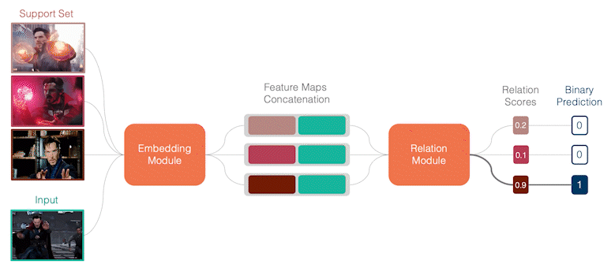

# Fast Learning Hand Gesture Recocgnition

## What is this repo about?

This repo provides a set of Few Shot Learning models, pretrained to recognize up to ten different dynamic hand gestures. It allows for easy adjustment to your individual hand gestures by providing a support set of one, two or five samples for each gestures. Unlike other image-based approaches which often require depth-maps, the models provided in this repo run on RGB data exclusively, by utilizing *mediapipe's* (GOOGLE LLC, 2020) hand-keypoints extraction. The models' architecture is inspired by Sung et al.'s *Relation Network* presented in 2018, which bases its predictions on the so-called relation scores. See the visualization for the rough functionality.

Each model is trained on up to 13,5-thousand tasks, whereas each task was to distinguish five or ten randomly drawn hand gestures from each other. Database of the training was the greatly modified *Jester* (Materzynska et al., 2019) dataset with 133 differenct classes in the train-, and 57 classes in each eval- and test-split. Evaluations of the six models on unseen data yielded accuracies of 70,3% to 88,8%. 

|          | 5-way,  1-shot | 5-way,  2-shot | 5-way,  5-shot | 10-way,  1-shot | 10-way,  2-shot | 10-way,  5-shot |
|:--------:|:-------------:|:-------------:|:-------------:|:--------------:|:--------------:|:--------------:|
| Accuracy |     77,3%     |     84,0%     |     88,8%     |      70,3%     |      75,7%     |      81,2%     |

The models are part of my master thesis at the FH-Muenster, therefore the content presented in the notebooks goes well beyond a simple model training. Much effort has been put into the data analysis, data preparation and hyperparameter-tuning. In addition, this project quantifies the savings in samples when tweaking a FSL model on a new set of hand gestures compared to training a standard Deep Learning model. 

## What to find in this repo?

All steps completed in the project can be reviewed in the jupyter *notebooks* published on this repo. Executing them on your own however requires some changes in the path configuration, since they are designed to work on my Google Colab Environment. The meta-trained models are available free for use in the folder *deployable_models* to allow the models to be embedded in your applications. 

- [notebooks](notebooks)
    - [data_preparation.ipynb](notebooks/data_preparation.ipynb): Data analysis, keypoints-extraction and additional data preparation steps.
    - [modelling_5way-1shot.ipynb](notebooks/modelling_5way-1shot.ipynb): Training, tuning and evaluation of the 5-way, 1-shot model.
    - [modelling_5way-2shot.ipynb](notebooks/modelling_5way-2shot.ipynb): Training, tuning and evaluation of the 5-way, 2-shot model.
    - [modelling_5way-5shot.ipynb](notebooks/modelling_5way-5shot.ipynb): Training, tuning and evaluation of the 5-way, 5-shot model.
    - [modelling_10way-1shot.ipynb](notebooks/modelling_10way-1shot.ipynb): Training, tuning and evaluation of the 10-way, 1-shot model.
    - [modelling_10way-2shot.ipynb](notebooks/modelling_10way-2shot.ipynb): Training, tuning and evaluation of the 10-way, 2-shot model.
    - [modelling_10way-5shot.ipynb](notebooks/modelling_10way-5shot.ipynb): Training, tuning and evaluation of the 10-way, 5-shot model.
    - [comparison_FSL_DL.ipynb](notebooks/comparison_FSL_DL.ipynb): Experiments to calculate the savings in samples.
- [deployment](deployment)
    - [models](deployment/models)
        - [5way-1shot_deployment_param.pkl](deployment/models/5way-1shot_deployment_param.pkl): Deployment-relevant information such as the number of LSTM-cells or number of units in the FeedForward layer.
        - [5way-1shot_feature_encoder.pkl](deployment/models/5way-1shot_feature_encoder.pkl): Meta trained weights and biases of the 5-way, 1-shot Embedding module.
        - [5way-1shot_relation_network.pkl](deployment/models/5way-1shot_relation_network.pkl): Meta trained weights and biases of the 5-way, 1-shot Relation module.
    - [mvp_gcolab.ipynb](deployment/mvp_gcolab.ipynb): MVP to test any model without the need to install packages or clone the repo on a local machine.

## How can I integrate a model in my application?

Deployment of the models still involves some manual work, which may be reduced in subsequent projects. A short example of the basic setup is shown in the notebook mvp_gcolab, which runs on any GPU powered Google Colab machine without adjustments. Please note: The Google Colab environment is slow on processing video files, which makes the model appear much slower than it is in reality. If you would like to deploy one of the models in your application and need help, feel free to open an issue and notify me. 

## Who should be given credit?

- GOOGLE LLC (2020). *MediaPipe Hands.* [https://google.github.io/mediapipe/solutions/hands.html](https://google.github.io/mediapipe/solutions/hands.html)

- Materzynska, J., Berger, G., Bax, I. & Memisevic, R. (2019). *The jester dataset: A large- scale video dataset of human gestures. Proceedings of the IEEE/CVF International Conference on Computer Vision Workshops.*

- Sung, F., Yang, Y., Zhang, L., Xiang, T., Torr, P. & Hospedales, T. (2018). Learning to Compare: Relation Network for Few-Shot Learning, 1199–1208. [https://doi.org/10.1109/CVPR.2018.00131](https://doi.org/10.1109/CVPR.2018.00131)

